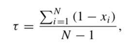

```{r, message=FALSE, warning=FALSE, include=FALSE}
library(pheatmap)
library(tidyverse)
```

# Overview
Here we implement the tissue-specificity index of Yanai et al, 2004. This is a number between 0 (ubiquitous) and 1 (perfect specificity), with empirically derived "midrange" thresholds of 0.15 and 0.85.

# Data loading
Load `genes`, `df`, and `mat`, gene features, data.frame, and expression matrix, respectively, into the environment.

```{r}
# Load expression data
```

## Genes of interest
Load the genes of interest into `symbols`.

```{r}
symbols <- c('GAPDH', 'TP53', 'CD8A')
```

# Calculating tau
The authors designed their tissue specificity index for microarray data, but the quantile-based binning is applicable to RNA-seq as well. We follow their per-sample quantile binning step to convert expression values into the integers 0 to 10. All values below a "noise" level were set to 0, and values above the noise level were spread across the 10 quantile bins. An arbitrary, microarray-specific value (`log10(30)`) was chosen for this lower limit of detection. We, also somewhat arbitrarily, choose the value `log2(TPM) = -5`, or `TPM = 2^-5 = 0.03125` as our lower limit, since that is approximately where the bimodal expression distribution tapers off.

We apply binning to the entire expression matrix, so that bin values are properly normalized.


```{r}
#' Convert expression vector in to 10 quantile bins (plus a 0 bin for below noise level)
convert_bins <- function(expr_vec, thresh=2^-5) {
  # Divide above-threshold values into 10 equal-density quantiles
  q <- quantile(expr_vec[expr_vec > thresh], 
                seq(0, 1, 0.1))
  
  # Assign integer bins
  b <- cut(expr_vec, q, labels=1:10) %>% as.integer
  
  # Replace NA (below the quantile minimum) with zero
  b[is.na(b)] <- 0
  
  return(b)
}

bins <- apply(mat, 2, convert_bins)
rownames(bins) <- rownames(mat)
```

The authors use ANOVA to separate genes into differentially expressed, not expressed, housekeeping (nonzero in all samples, and SD across samples < 1 quantile unit after binning into 10 quantiles), and uncategorized. It makes sense to separate housekeeping from not expressed genes, since both would have the same tissue specificity index of 0. Instead of splitting into categories, though, we'll just keep them together and deal with non-expressed genes later.

The tau index is defined as: 

where _N_ is the number of tissues and _xi_ is the "expression profile component normalized by the maximal component value". As an R function, this is simply:

```{r}
tau <- function(x) {
  # Normalize to max
  x_norm <- x / max(x)
  
  # Return tau
  sum(1-x_norm) / (length(x) - 1)
}
```

Now let's apply tau to all genes, pull out the genes, and use NA's to catch non-expressed genes
```{r}
tau_vector <- apply(bins, 1, tau)
tau_df <- data.frame(gene_id=names(tau_vector), tau=tau_vector) %>%
  inner_join(genes, by='gene_id') %>%
  mutate(status = symbol %in% symbols)
head(tau_df)
```

We'll save the tau values to file, removing non-expressed genes and adding the max value of each gene across all tissues

```{r}
# Get max expression values by gene
max_expr_df <- df %>%
  group_by(symbol) %>%
  summarize(
    max_expr = max(log2_tpm),
    max_tissue = tissue[which.max(log2_tpm)])

# Filter for genes of interest and write tau metrics to file
tau_filtered <- tau_df %>%
  filter(symbol %in% symbols) %>%
  filter(!is.na(tau)) %>%
  select(gene_id, symbol, tau) %>%
  inner_join(max_expr_df, by='symbol') %>%
  arrange(desc(tau))
write_csv(tau_filtered, '../results/tau.genes_of_interest.gtex.csv')
```

Let's look at the distribution of `tau` in the genes, compared with the rest of the population.

```{r}
ggplot(tau_df, aes(x=tau, color=status)) + geom_density()
ggsave('../results/tau.density.genes_of_interest.gtex.png')
```

A boxplot displays the same message in a more familiar way, and also highlights vast differences among the medians and ranges of these distributions.

```{r}
tau_df %>%
  ggplot(aes(x=status, y=tau)) + 
  geom_boxplot() + 
  theme_bw() +
  labs(x = '', title = 'Genes of interest versus all others')
ggsave('../results/tau.boxplot.genes_of_interest.gtex.png')
```

Thresholding the tau values based on the `0.15 < tau < 0.85` midrange cutoffs suggested in the paper, we can grab a few examples from each group and plot across tissues:

```{r, fig.width=10}
# Set up a plotting function
plot_by_tissue <- function(gene_ids, label_thresh=-9) {
  df %>%
    filter(gene_id %in% gene_ids) %>%
    mutate(label = ifelse(log2_tpm > label_thresh, tissue, '')) %>%
    ggplot + 
      geom_point(aes(x=tissue, y=log2_tpm, color=status)) + 
      geom_text(aes(x=tissue, y=log2_tpm - 1, label=label), size=4) +
      facet_wrap(~symbol) +
      theme(axis.text.x = element_blank())
}

# Plot the highest 3 tau values
plot_by_tissue(tau_filtered$gene_id %>% head(3)) +
  ggtitle('Example: 3 highly specific genes')
```

It looks like the high tau values are indeed specifically expressed. 

We can filter for maximum expression first to weed out these false positives.

```{r, fig.width=10}
tau_filtered %>%
  filter(max_expr > 1) %>%
  head(3) %>%
  .$gene_id %>%
  plot_by_tissue +
    ggtitle('Example: 3 highly specific genes')
ggsave('../results/tau.top3.genes_of_interest.gtex.png')
```

These top hits illustrate the presence of highly specific proteins in a diversity of tissues.

Now let's make sure the low tau values are ubuiquitous but not all zero.

```{r, fig.width=10}
tau_filtered %>%
  tail(3) %>%
  .$gene_id %>%
  plot_by_tissue(label_thresh=20)
```

Finally, let's explore a few midrange examples. We'll pull the top 3 for `tau <= 0.85`
```{r, fig.width=10}
tau_filtered %>%
  filter(tau < 0.85) %>%
  head(3) %>%
  .$gene_id %>%
  plot_by_tissue(label_thresh=1) +
    ggtitle('Example: 3 genes with "midrange" tau')
```


# Conclusion
The tau metric seems to work as advertised, with high values assigned to very tissue-specific genes and low values denoting ubiquitous genes. 

The table of tau values was annotated with the maximum expression value across all tissues, as well as the tissue type exhibiting that maximum expression. Browsing this list reveals many interesting candidates for tissue-specific proteins.